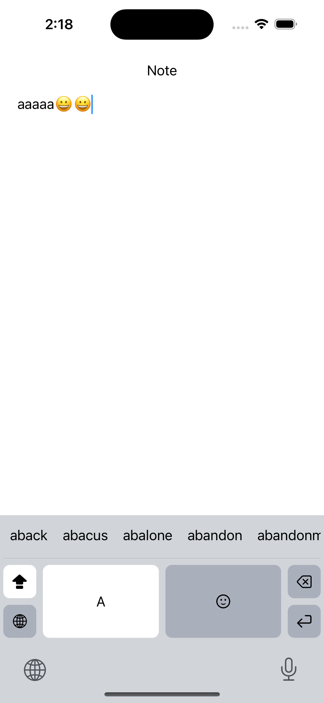

# KeyboardExtensionKit

The Convenience Kit for [iOS Custom Keyboard Extension](https://developer.apple.com/documentation/uikit/keyboards_and_input/creating_a_custom_keyboard/).

You can easily develop a custom keyboard using SwiftUI!

## Contetns

### KEKeyButton

タップして文字を入力するためのボタン向けコンポーネント。

### KECommandButton

タップしてコマンドを実行するためのボタン向けコンポーネント。

### KERepeatableCommandButton

タップすると１回コマンドを実行し、長押しすると繰り返しコマンドを実行するボタン向けコンポーネント。

### ShiftButton

タップするとシフトのオンオフが切り替えられて、ダブルタップするとCapsLock状態に切り替えられるシフトキー向けコンポーネント。

### GlobeButton

タップすると次のソフトウェアキーボードに切り替え、長押しするとソフトウェアキーボード一覧のモーダルを表示するボタン向けコンポーネント。

### KECandidatesView

文字入力の候補を表示するコンポーネント。候補を選択するとその内容が挿入されるような実装が可能。

### KEKeyboardViewProtocol

キーボードのレイアウトを司る`KeyboardView`を実装する際に依存の型解決をするための`protocol`。

### KEKeyboardViewController

`UIInputViewController`を扱いやすいようにラップしてあるもの。`KeyboardView`の埋め込みもやってくれる。

### KEKeyboardModel(Protocol)

キーボードのロジックを司る`KeyboardModel`を実装する際に依存の型解決をするための`protocol`とベースとなる実装。

## Sample

**KeyboardExtensionKitSample**

`KeyboardView`、`KeyboardModel`、`KeyboardViewController`の実装例。
